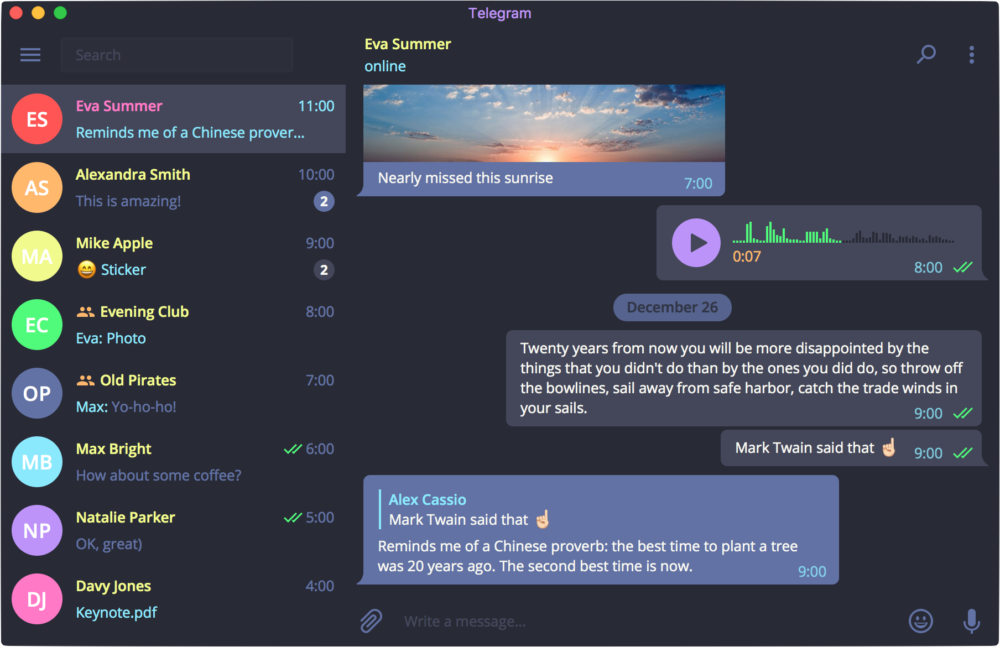

# Dracula for [Telegram Desktop](https://desktop.telegram.org/)

> :smiling_imp: A dark theme for [Telegram Desktop](https://desktop.telegram.org/) based on the Dracula Palette.

## Installation
1. Go to [Releases](https://github.com/dracula/telegram/releases) and download the latest version.

	*The file that needs to be downloaded is under each release called `dracula-theme.tdesktop-theme`.*
2. In **Telegram Desktop** go to setting and under the `Chat background` section click on `Choose from file` and select the file you just downloaded.
3. Click `Keep Changes` to apply the theme.

	*(The theme is also available on the [Desktop Themes Channel](https://t.me/themes))*

## Palette

Based on https://github.com/dracula/dracula-theme

## Team

This theme is maintained by the following person(s) and a bunch of [awesome contributors](https://github.com/dracula/telegram/graphs/contributors).

  | 
--- | ---
 [Neil Smith](https://github.com/nmsmith22389) | [Irfan Maulana](https://github.com/mazipan)

## Changelog

See the [releases](https://github.com/dracula/telegram/releases) page for the list of changes.

## License

[MIT License](./LICENSE)
